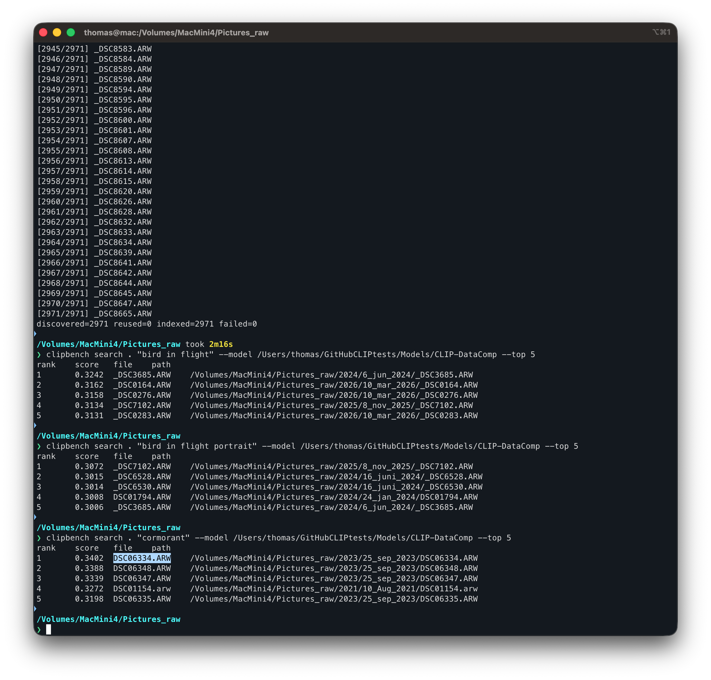

# CLIPBench Test

CLIPBench is an experimental command-line tool for testing local semantic search across photo collections. This test package includes the `clipbench` binary and a converted CLIP DataComp model.

CLIPBench tests CLIP models using Apple's CoreAI framework in Xcode 27 and macOS 27. The next version of RawCull (AI) is in test and will be released with macOS 27. The non-AI version of RawCull 2.3.2 is available on the Apple App Store.

To try the command-line search for your ARW files, email me. The test package is signed and ready to use, but requires terminal and command-line knowledge. See example of use below.

## Requirements

- Apple silicon Mac
- macOS 27 or later
- A copied or backed-up photo directory for testing

CLIPBench supports JPEG, PNG, HEIC/HEIF, TIFF, and Sony ARW files. ARW files are indexed using their embedded JPEG previews.

## Quick start

Open Terminal, change to this directory, and run:

```sh
./clipbench inspect-model --model ./CLIP-DataComp
./clipbench index "/path/to/photos" --model ./CLIP-DataComp
./clipbench search "/path/to/photos" "bird in flight" \
  --model ./CLIP-DataComp --top 10
```

The first model use may take additional time while macOS prepares and specializes the model.

CLIPBench does not modify the source photos. It creates a hidden `.clipbench` directory inside the directory being indexed and stores the generated search index there. Removing that hidden directory removes the generated index.

All model inference runs locally on the Mac. CLIPBench does not upload photos, search prompts, or embeddings.

## Experimental software

This package is for testing. Semantic-search results are relative similarity scores, not statements of fact, and may be inaccurate, incomplete, biased, or unexpected. Do not rely on the results for safety-critical, legal, medical, employment, identity, surveillance, or other high-impact decisions.

Use CLIPBench only on content you are authorized to process. Test first with copies or backed-up photo directories.

## Licences and no warranty

CLIPBench, PhotoAIKit, and RawParserKit are distributed under the MIT Licence. Those licence texts are included in this package. The converted model and its OpenCLIP source are identified as MIT-licensed by the upstream model repository. The tokenizer files originate from OpenAI CLIP and are accompanied by the OpenAI MIT Licence.

Apple `coreai-models`, used in the conversion/runtime toolchain, is distributed under the BSD 3-Clause Licence. Its required notice is also included.

See `MODEL-INFORMATION.md`, `PROVENANCE.json`, and the `THIRD-PARTY-NOTICES` directory for details and source links.

CLIPBench is provided **"AS IS"**, without warranty of any kind, express or implied. To the fullest extent stated in the included MIT Licence, the copyright holders and contributors are not liable for claims, damages, or other liability arising from the software or its use. This includes faults, errors, incorrect search results, data loss, and incompatibility. This summary does not replace the complete licence terms.

## Integrity check

Before running the package:

```sh
shasum -a 256 -c SHA256SUMS.txt
```

The distributor must regenerate `SHA256SUMS.txt` and recreate the ZIP after code-signing `clipbench`, because signing changes the executable.

## In use for test

I have installed the complete package in `/Users/thomas/bin` catalog and my ARW raw-files are saved on a external SSD-drive at `/Volumes/MacMini4/Pictures_raw`. The `clipbench` does a recursive scan of all catalogs and saves index at root of photo catalog (`/Volumes/MacMini4/Pictures_raw/.clipbench`). A scan and indexing of all my 2900 ARW files on my MacBook Mini M4 (standard model) took 2 min 16 seconds. 




## Verify the shasum of the package

```sh
shasum -a 256 -c SHA256SUMS.txt
./CLIP-DataComp/LICENSE-MODEL.txt: OK
./CLIP-DataComp/ViT-B-32-256-datacomp_s34b_b86k_float16_static.aimodel/main.hash: OK
./CLIP-DataComp/ViT-B-32-256-datacomp_s34b_b86k_float16_static.aimodel/main.mlirb: OK
./CLIP-DataComp/ViT-B-32-256-datacomp_s34b_b86k_float16_static.aimodel/metadata.json: OK
./CLIP-DataComp/metadata.json: OK
./CLIP-DataComp/tokenizer/merges.txt: OK
./CLIP-DataComp/tokenizer/special_tokens_map.json: OK
./CLIP-DataComp/tokenizer/tokenizer.json: OK
./CLIP-DataComp/tokenizer/tokenizer_config.json: OK
./CLIP-DataComp/tokenizer/vocab.json: OK
./LICENSE-CLIPBENCH.txt: OK
./MODEL-INFORMATION.md: OK
./PROVENANCE.json: OK
./README.md: OK
./THIRD-PARTY-NOTICES/Apple-coreai-models-BSD-3-Clause.txt: OK
./THIRD-PARTY-NOTICES/OpenAI-CLIP-Tokenizer-MIT.txt: OK
./THIRD-PARTY-NOTICES/OpenCLIP-DataComp-MIT.txt: OK
./THIRD-PARTY-NOTICES/PhotoAIKit-MIT.txt: OK
./THIRD-PARTY-NOTICES/README.txt: OK
./THIRD-PARTY-NOTICES/RawParserKit-MIT.txt: OK
./clipbench: OK
```

## Index all files in catalog including sub catalogs

```sh
./clipbench index "/Volumes/MacMini4/Pictures_raw" --model ./CLIP-DataComp
```
## Clip semantic search produces the following

Search for "cormorant" in about 3000 ARW-files across several sub catalogs is completed in seconds. 

```sh
./clipbench search "/Volumes/MacMini4/Pictures_raw" "cormorant" \
  --model ./CLIP-DataComp --top 5
rank	score	file	path
1	0.3402	DSC06334.ARW	/Volumes/MacMini4/Pictures_raw/2023/25_sep_2023/DSC06334.ARW
2	0.3388	DSC06348.ARW	/Volumes/MacMini4/Pictures_raw/2023/25_sep_2023/DSC06348.ARW
3	0.3339	DSC06347.ARW	/Volumes/MacMini4/Pictures_raw/2023/25_sep_2023/DSC06347.ARW
4	0.3272	DSC01154.arw	/Volumes/MacMini4/Pictures_raw/2021/10_Aug_2021/DSC01154.arw
5	0.3198	DSC06335.ARW	/Volumes/MacMini4/Pictures_raw/2023/25_sep_2023/DSC06335.ARW
```

